# EAGV3 Session 7 — Agent with FAISS Vector Memory

[](https://www.youtube.com/watch?v=b0QvnfZVDiA)

Session 7 agent built on a five-layer cognitive loop. The key addition over Session 6 is **vector memory**: every fact written to memory is embedded via the gateway's `/v1/embed` endpoint and stored in a FAISS index. Reads use cosine similarity first and fall back to keyword overlap when the vector path returns nothing. Two new MCP tools — `index_document` and `search_knowledge` — expose the same machinery to the model so it can ingest external documents on demand and query them across process restarts.

---

## Architecture

```
User Query
    │
    ▼
┌─────────────────────────────────────────────────────────────┐
│                     agent7.py  (orchestrator)               │
│                                                             │
│  ┌──────────┐   ┌─────────────┐   ┌──────────┐             │
│  │ memory   │──▶│ perception  │──▶│ decision │             │
│  │ .read()  │   │ .observe()  │   │ .next_   │             │
│  └──────────┘   └─────────────┘   │  step()  │             │
│       ▲                           └────┬─────┘             │
│       │                                │                    │
│  ┌────┴──────────────────┐    ┌────────▼──────┐            │
│  │ memory.record_outcome │◀───│ action        │            │
│  │ (zero-LLM write)      │    │ .execute()    │            │
│  └───────────────────────┘    └───────────────┘            │
└─────────────────────────────────────────────────────────────┘
         │                              │
         ▼                              ▼
  ┌─────────────┐              ┌─────────────────┐
  │  state/     │              │  MCP Server     │
  │  memory.json│              │  (11 tools)     │
  │  index.faiss│              │  mcp_server.py  │
  │  artifacts/ │              └────────┬────────┘
  └─────────────┘                       │
                                        ▼
                               ┌─────────────────┐
                               │  LLM Gateway V7 │
                               │  :8107          │
                               │  /v1/chat       │
                               │  /v1/embed      │
                               └─────────────────┘
```

Each iteration of the loop runs five steps in order:

| Step | Layer | Role |
|------|-------|------|
| 1 | **Memory read** | Vector search (FAISS) → keyword fallback; returns ranked `MemoryItem` list |
| 2 | **Perception** | LLM call; maintains goal list, marks goals done, attaches artifact handles |
| 3 | **Decision** | LLM call; emits one tool call **or** a final answer |
| 4 | **Action** | Dispatches the MCP tool; large results (>4 KB) go to the artifact store |
| 5 | **Memory write** | Zero-LLM record of the tool outcome; embeds the descriptor into FAISS |

---

## Code Structure

### Agent (`s7code/`)

| File | Role |
|------|------|
| `agent7.py` | Orchestrator — runs the five-step loop, wires the four layers together |
| `perception.py` | Goal decomposition and artifact-attach decisions; LLM-driven with JSON schema output |
| `decision.py` | One LLM call per turn; emits a tool call or a plain-text answer |
| `action.py` | MCP dispatcher; offloads large results (>4 KB) to the artifact store |
| `memory.py` | Read (vector → keyword) and write (LLM classifier + FAISS embed) for `MemoryItem` records |
| `vector_index.py` | FAISS `IndexFlatIP` wrapper with disk persistence (`state/index.faiss`) |
| `artifacts.py` | Content-addressed blob store keyed by SHA-256; metadata in `state/artifacts/` |
| `mcp_server.py` | FastMCP server with 11 tools (see table below) |
| `gateway.py` | Bridge to LLM Gateway V7; auto-starts gateway if not running |
| `schemas.py` | Pydantic contracts shared by all layers (`MemoryItem`, `Goal`, `Observation`, `DecisionOutput`) |

### MCP Tools (`mcp_server.py`)

| Tool | Description |
|------|-------------|
| `web_search` | Tavily primary, DuckDuckGo fallback; hard-capped at 5 results |
| `fetch_url` | crawl4ai headless Chromium; returns clean page markdown |
| `get_time` | Current time in any IANA timezone |
| `currency_convert` | Live rates via frankfurter.dev |
| `read_file` | Read a UTF-8 file from `sandbox/` |
| `list_dir` | List a directory inside `sandbox/` |
| `create_file` | Create a new file in `sandbox/` |
| `update_file` | Overwrite an existing `sandbox/` file |
| `edit_file` | Find-and-replace inside a `sandbox/` file |
| `index_document` | Chunk a sandbox file into 400-word windows, embed each chunk, write to FAISS |
| `search_knowledge` | Vector search over indexed fact chunks |

### LLM Gateway (`llm_gatewayV7/`)

| File | Role |
|------|------|
| `main.py` | FastAPI app; `/v1/chat`, `/v1/embed`, `/v1/status`, `/v1/routers` |
| `providers.py` | Provider adapters: Gemini, NVIDIA, Groq, Cerebras, OpenRouter, GitHub, Anthropic, Ollama |
| `embedders.py` | Embed providers: Ollama (`nomic-embed-text`) and Gemini (`gemini-embedding-001`), both 768-dim |
| `router.py` | Rate-state tracking; picks the next available provider respecting RPM/RPD/TPM/cooldown |
| `client.py` | Python client (`LLM().chat()`, `LLM().embed()`) used by the agent |
| `cache.py` | Gemini prompt-cache wrapper |

### Persistent State (`state/`)

| Path | Contents |
|------|----------|
| `state/memory.json` | All `MemoryItem` records (facts, preferences, tool outcomes) |
| `state/index.faiss` | FAISS `IndexFlatIP` — 768-dim cosine vectors for embeddable items |
| `state/index_ids.json` | Ordered list of `MemoryItem` ids parallel to FAISS integer positions |
| `state/artifacts/` | Binary blobs (`<sha256>.bin`) + metadata (`<sha256>.json`) |

---

## Setup

### 1. Install dependencies

```powershell
cd D:\sjk\eagv3\s7\s7code
$env:UV_NATIVE_TLS = "1"          # needed on corporate networks
uv sync
uv run playwright install chromium # required by fetch_url
```

### 2. Environment variables

Copy `.env.example` to `.env` and fill in keys:

```
GEMINI_API_KEY=...
ANTHROPIC_API_KEY=...
NVIDIA_API_KEY=...
GROQ_API_KEY=...
CEREBRAS_API_KEY=...
OPEN_ROUTER_API_KEY=...
GITHUB_ACCESS_TOKEN=...
TAVILY_API_KEY=...
GATEWAY_V7_PORT=8107
```

### 3. Start the gateway

```powershell
cd D:\sjk\eagv3\s7\s7code\llm_gatewayV7
uv run python main.py
```

The agent auto-starts the gateway if it is not already running, but starting it manually avoids the 45-second startup wait on the first query.

### 4. Run a query

```powershell
cd D:\sjk\eagv3\s7\s7code
$env:UV_NATIVE_TLS = "1"
$env:NODE_EXTRA_CA_CERTS = "$env:TEMP\win-ca.pem"   # corporate cert fix
uv run agent7.py "<your query here>"
```

---

## Queries A – H

Run the eight queries in order. Maintain state across F-run-1 → F-run-2 → G → H. Clear state before E and before F-run-1.

```powershell
# Helper
function Clear-AgentState {
    uv run python -c "import memory; memory.clear()"
}
```

---

### Query A — Shannon Wikipedia
**Artifact attach · 3 iterations**

> Fetch https://en.wikipedia.org/wiki/Claude_Shannon and tell me his birth date, death date, and three key contributions to information theory.

Decision calls `fetch_url`. Action pushes 256 KB of Wikipedia markdown to the artifact store. Perception attaches the artifact to the extraction goal in iteration 2. Decision answers from the attached bytes — no vector retrieval involved.

```powershell
uv run agent7.py "Fetch https://en.wikipedia.org/wiki/Claude_Shannon and tell me his birth date, death date, and three key contributions to information theory."
```

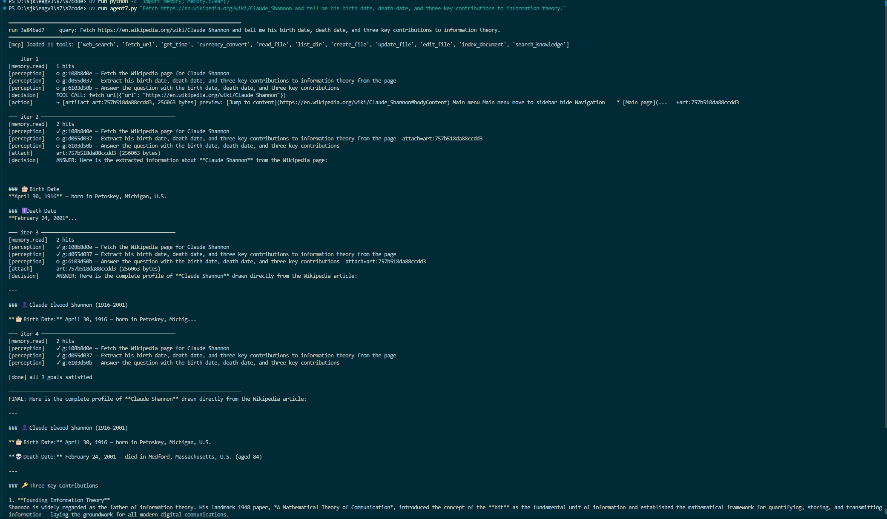
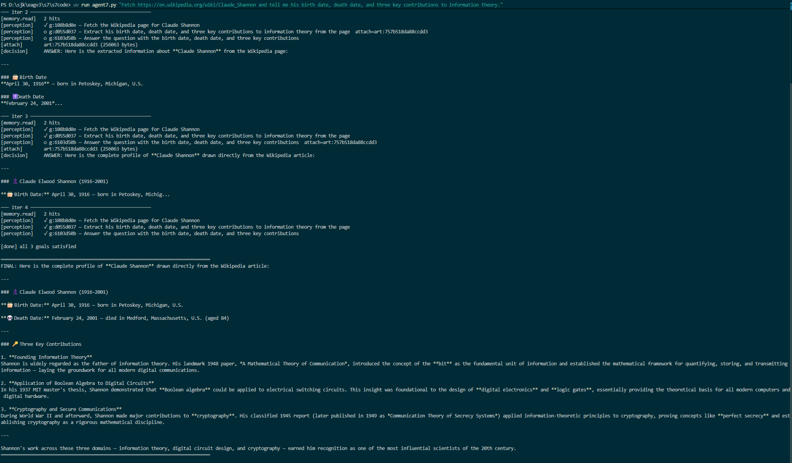

---

### Query B — Tokyo Activities and Weather
**Multi-goal · memory carryover · 8 iterations**

> Find 3 family-friendly things to do in Tokyo this weekend. Check Saturday's weather forecast there and tell me which one is most appropriate.

Perception decomposes into three goals: find activities, fetch the weather, select an activity. Memory carries the weather forecast from the second goal's tool outcome into the third goal's Decision through the keyword path.

```powershell
uv run agent7.py "Find 3 family-friendly things to do in Tokyo this weekend. Check Saturday's weather forecast there and tell me which one is most appropriate."
```

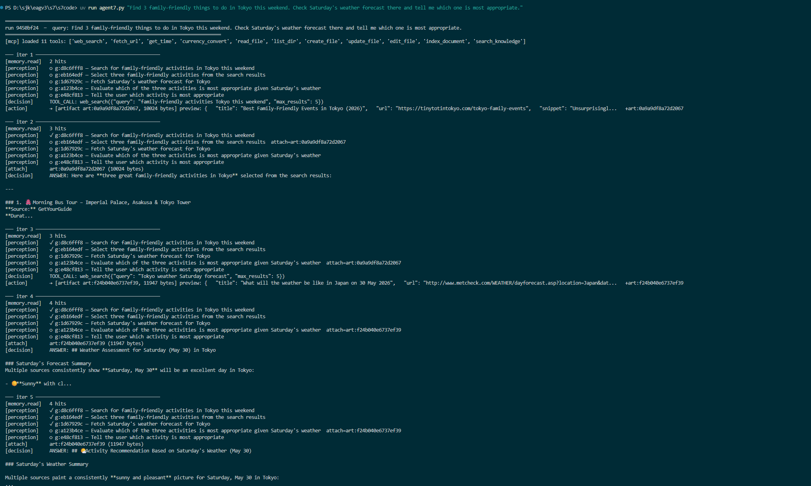
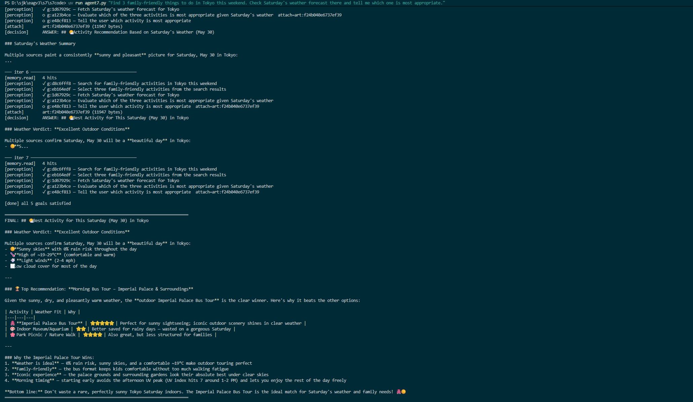

---

### Query C — Mom's Birthday
**Durable memory across runs · Run 1: 4 iter · Run 2: 3 iter, 0 tool calls**

**Run 1** — remembers the date and creates sandbox reminder files:

> My mom's birthday is 15 May 2026. Remember that and create reminders for two weeks before and on the day.

The classifier writes a `fact` item with the date in both the descriptor and the value. Two `create_file` calls produce reminder files. The fact item carries an embedding.

**Run 2** — fresh process, reads from FAISS:

> When is mom's birthday?

Memory's read embeds the query, FAISS returns the fact item from Run 1, Perception sees the date in the rendered hit, and Decision answers directly without calling any tool.

```powershell
# Run 1
uv run agent7.py "My mom's birthday is 15 May 2026. Remember that and create reminders for two weeks before and on the day."

# Run 2 (new process, state preserved on disk)
uv run agent7.py "When is mom's birthday?"
```

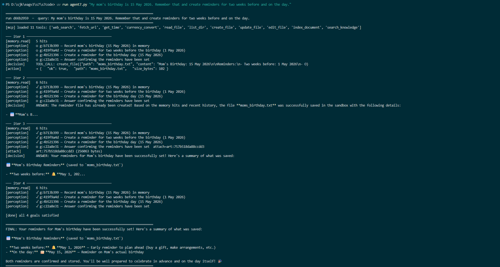
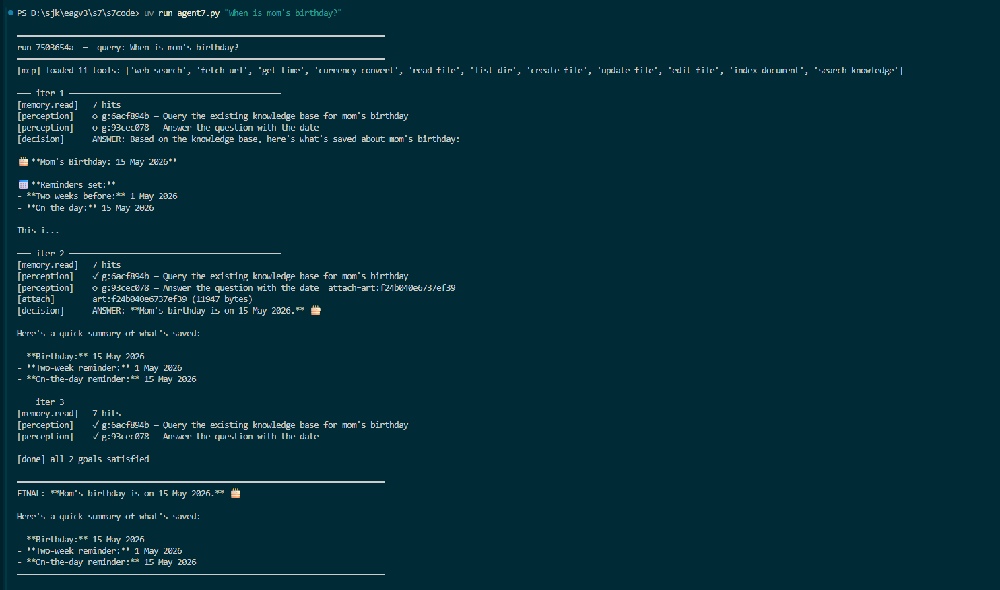

---

### Query D — Asyncio Research
**Multi-source synthesis · 6 iterations**

> Search for "Python asyncio best practices", read the top 3 results, and give me a short numbered list of the advice they agree on.

The agent searches, fetches three pages as artifacts, and synthesises common advice. Vector retrieval does not contribute; the three pages are attached to the synthesis goal as artifacts produced inside the same run.

```powershell
uv run agent7.py "Search for 'Python asyncio best practices', read the top 3 results, and give me a short numbered list of the advice they agree on."
```

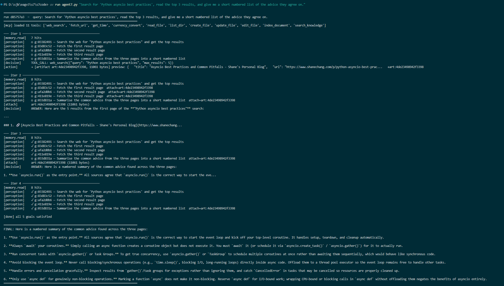

---

### Query E — Single-document Index and Extract
**`index_document` + `search_knowledge` · 5 iterations**

> Index the file papers/attention.md and tell me what the three key contributions of the Transformer architecture are according to this paper.

**Clear state before running.**

Perception decomposes into two goals: index the file, then answer from the indexed content. Action reads `papers/attention.md`, chunks it into eleven 400-word windows with 80-word overlaps, embeds each chunk, and writes them as fact items. Perception then emits an attach hint; Decision calls `search_knowledge` and answers from the returned chunks.

```powershell
uv run python -c "import memory; memory.clear()"
uv run agent7.py "Index the file papers/attention.md and tell me what the three key contributions of the Transformer architecture are according to this paper."
```

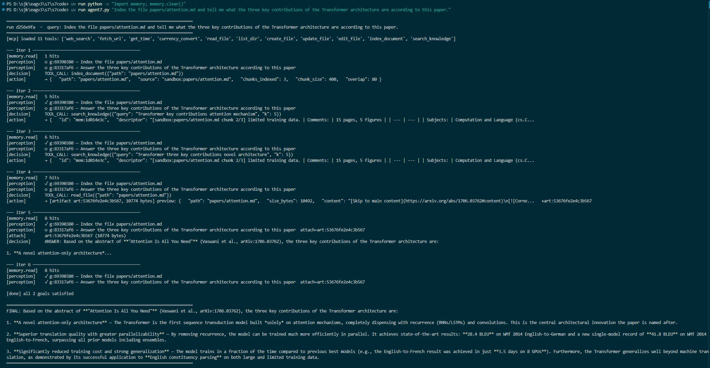

---

### Query F — Cross-run Document Recall
**FAISS persistence · Run 1: 11 iter · Run 2: 3 iter**

**Clear state before Run 1.**

**Run 1** — indexes all five papers:

> Index every .md file under papers/. Confirm how many chunks were indexed in total.

Perception emits a `list_dir` discovery goal. After listing, it appends one `index_document` goal per paper file. Five `index_document` calls run on iterations 3–7, producing 15 chunks across five papers. State after Run 1: `memory.json` (23 items, 15 chunk facts), `index.faiss` (23 vectors at dim 768).

**Run 2** — fresh process, cold start from disk:

> Across the papers I have indexed, what do they say about chain-of-thought reasoning?

Memory reads the persisted FAISS index. Perception recognises the chunk descriptors and emits `search_knowledge` + synthesis goals. Three iterations. No re-fetching.

```powershell
uv run python -c "import memory; memory.clear()"

# Run 1
uv run agent7.py "Index every .md file under papers/. Confirm how many chunks were indexed in total."

# Run 2 — DO NOT clear state
uv run agent7.py "Across the papers I have indexed, what do they say about chain-of-thought reasoning?"
```

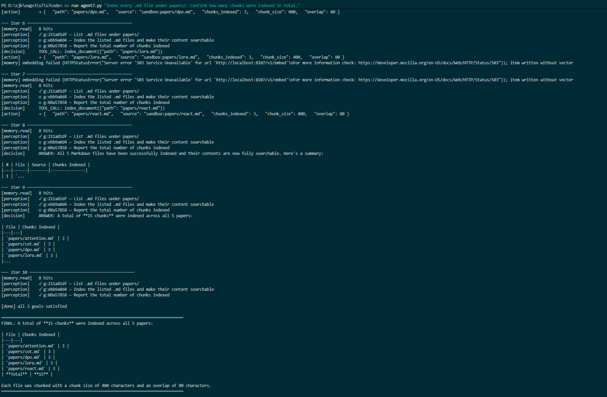
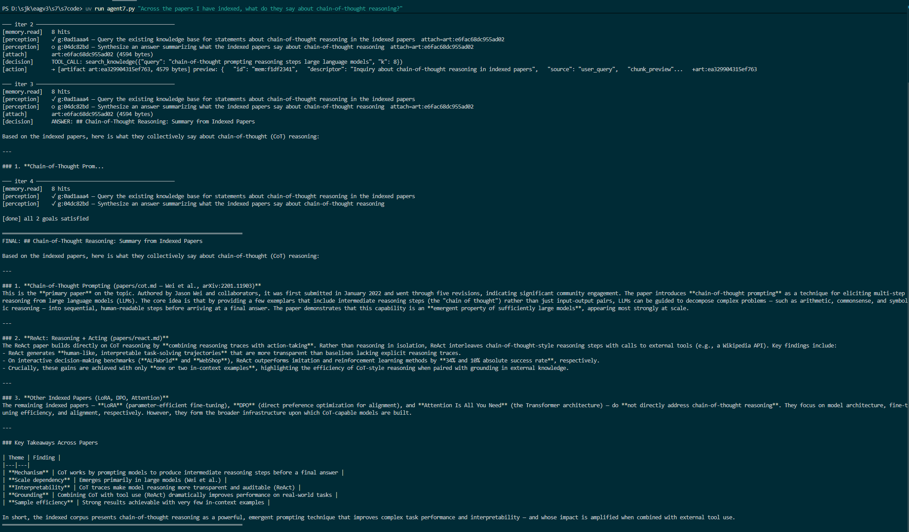

---

### Query G — Synonym Recall (Vector Beats Keyword)
**Semantic search · 4 iterations · uses F corpus**

> Across these papers, how do they handle the credit assignment problem?

The phrase "credit assignment" appears in none of the indexed chunks — keyword search returns nothing. The vector path surfaces conceptually related chunks from four papers: backpropagation through reasoning steps (CoT), reward shaping (DPO), intermediate signals (ReAct), and parameter-efficient credit distribution (LoRA). Decision synthesises and attributes each claim to its source.

This is the strongest demonstration of the session. Vector retrieval performs a search that keyword retrieval cannot.

```powershell
# State from F must be intact — do NOT clear
uv run agent7.py "Across these papers, how do they handle the credit assignment problem?"
```

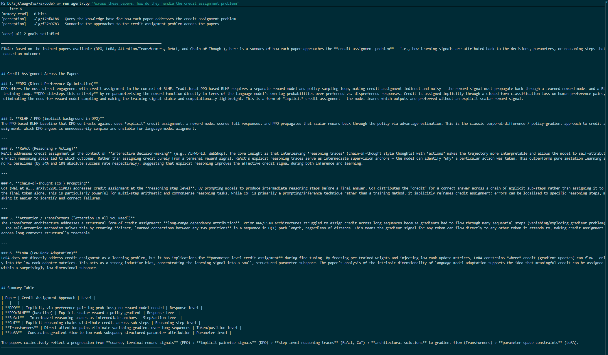

---

### Query H — Cross-document Synthesis
**Multi-paper comparison · 3 iterations · uses F corpus**

> Compare how the ReAct paper and the Chain-of-Thought paper differ in their treatment of intermediate reasoning.

`search_knowledge` returns chunks from both papers. Decision reads the attached chunks and produces a comparison: ReAct interleaves reasoning with tool actions; CoT emphasises linear stepwise reasoning. Each claim is attributed to its source paper.

```powershell
# State from F must be intact — do NOT clear
uv run agent7.py "Compare how the ReAct paper and the Chain-of-Thought paper differ in their treatment of intermediate reasoning."
```

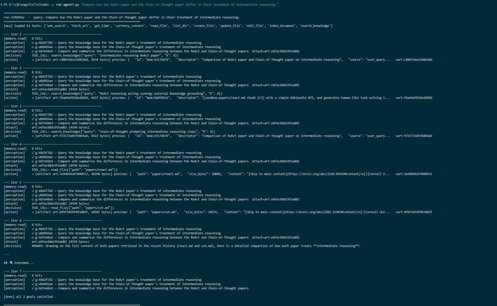
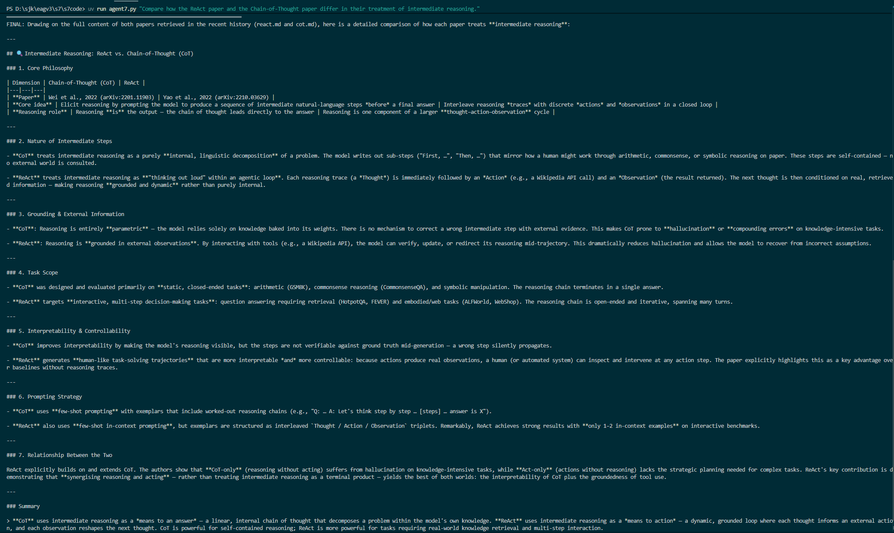

---

## Run Order and State Management

```
1.  memory.clear()                    ← fresh start
2.  Query A   (3 iter)
3.  Query B   (8 iter)
4.  Query C   Run 1  (4 iter)         ← writes birthday fact to FAISS
5.  Query C   Run 2  (3 iter)         ← reads from FAISS (must be before next clear)
6.  Query D   (6 iter)
7.  memory.clear()                    ← fresh FAISS for E
8.  Query E   (5 iter)
9.  memory.clear()                    ← fresh FAISS for F corpus
10. Query F   Run 1  (11 iter)        ← builds 15-chunk corpus
11. Query F   Run 2  (3 iter)         ← cold process, same disk state
12. Query G   (4 iter)                ← NO clear between F and G
13. Query H   (3 iter)                ← NO clear between G and H
```

**Critical constraint:** C Run 2 must run before any `memory.clear()` call, because the birthday fact written in C Run 1 is deleted by the clear.

---

## Papers in `sandbox/papers/`

| File | Topic |
|------|-------|
| `attention.md` | Transformer architecture — self-attention, parallel computation, positional encoding |
| `cot.md` | Chain-of-Thought prompting — linear stepwise reasoning |
| `dpo.md` | Direct Preference Optimisation — reward shaping without a separate reward model |
| `lora.md` | LoRA — parameter-efficient fine-tuning |
| `react.md` | ReAct — interleaving reasoning traces and tool actions |
